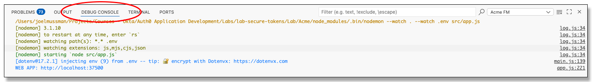
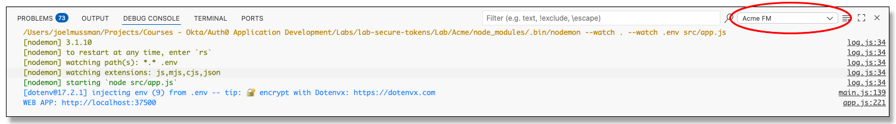
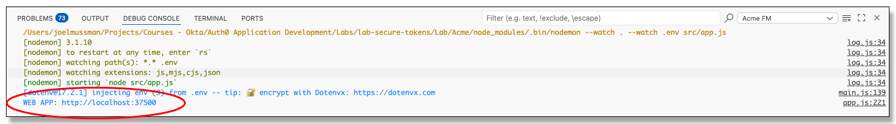
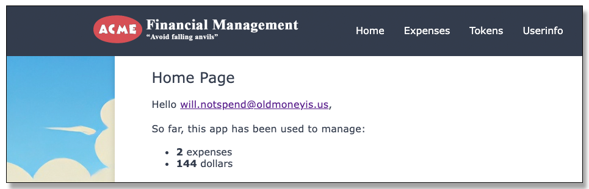
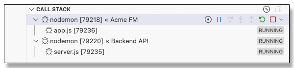

# Lab: Private Key JWT

## Dependencies

* The Auth0 integration for the ACME Financial Management application set up in part two of the
[Application Integration](https://github.com/auth0-sandbox/lab-app-integration) lab.
* The user *will.notspend@oldmoneyis.us* created in the lab-app-integration lab.
* The Auth0 Acme FM Backend API integration, the roles, and the role assigned to 
the user *will.notspend@oldmoneyis.us* from part 2 of the 
[API Access Management](https://github.com/auth0-sandbox/lab-api-access-management) lab.

<!--
NOTES:
1. The presentation before this lab should address how the flow through authorization code grant works (again),
how express-openid-connect registers the /login, /callback, and /logout endpoints in its own middleware,
and how the application using openid-client needs to do the registrations itself.
2. Explain how PK JWT works; a PK JWT with iss, sub, aud, jti, and exp is created by the client.
The PK JWT is sent in place of the secret during the request. If the PK JWT signature works with the
registered public key and the claims work, there is high assurance.
-->

## Synopsis

This project explorers replacing the CLIENT_SECRET with a Private Key JWT.
PK JWT depends on asymmetric encryption (private and public keys).
The public key is registered with the Auth0 tenant.
When the client is authenticating to perform the token exchange it builds and sends a JWT
signed with the application private key.
If the JWT signature may be decrypted with the public key registered at the
identity provider, and the claims are correct, then there is extremely high assurance
that the keys are being exchanged with the legitimate client.

None of the Auth0 SDKs for any platform have support for PK JWT. 
The *express-openid-connect* SDK is a wrapper around *openid-client*, an Auth0 supported project.
*openid-client* does support PK JWT, it is just that *express-openid-connect* does not expose it.
*openid-client* however does not integrate with the *Express framework*, so more work
has to be done in the application to replace *express-openid-connect* with *openid-client*.

## Lab Setup

This lab may be completed on your local development computer, in a Docker container, or in a
GitHub Codespace in the GitHub cloud (also a Docker container).
Details about configuring the three different lab environment scenarios are available in the
[Auth0 Sandbox Application Development](https://github.com/auth0-sandbox/application-development) repository.

In the development environment the following instructions are designed to be presented in dual editor panels in VS Code:
the instructions on the left and the code on the right.
The instructions will open automatically with VS Code; the steps are designed to control opening the code at the right.

Terminal commands and text to add to code or configuration files may be highlighted in the instructions, copied,
and pasted.
Make sure if a command is copied the prompt ($) is not included.

Our apologies if you have seen some of these instructions before in a previous lab and find them redundant.
Each lab is set up to work as much as possible as a stand-alone unit.

# Lab Instructions

## Part 1: Set up the backend API

1. Close any open terminal windows.
    If only one is open a trash can will appear at the upper right (use the trash can, the X just hides
    the terminal panel): .
    If more than one terminal is open a list will be at the right of the panel and a toolbar will
    appear as you hover over each with the mouse pointer.
    Or, you can just type "exit" at the command prompt to close the command shell in a terminal window.

1. In the Explorer panel locate the folder "Lab/API",
right-click, and choose *Open in Integrated Terminal*.

1. In the new terminal window use *npm* to install the dependency packages:

    ```bash
    $ npm install
    ```

1. In the *Explorer* locate the *Lab/API/.env file, right-click, and select *open to the side*.

1. Open the Auth0 tenant, use *Applications &rarr; Applications*, locate the
    *Acme Financial Management* application and open it.

1. On the *Settings* tab for the application find *Advanced Settings* at the bottom of the
    page and open it.

1. Scroll down to the bottom, expand the *Advanced Settings* section, click on the *Endpoints*
    tab and copy the value for *JSON Web Key Set*.

1. Set the *JWKS_URI* variable in the .env file to the copied value
    (this is the tenant that was used for testing, your URL will be different):
    ```js
    JWKS_URI=https://dev-lab-jmussman-20250714.us.auth0.com/.well-known/jwks.json
    ```

1. Build the *ISSUER* from the same value by removing the path after the domain but keep the trailing /
(your URL will be different):
    ```js
    ISSUER=https://dev-lab-jmussman-20250714.us.auth0.com/
    ```

    NOTE: Auth0 always uses https://{domain name}/ with the trailing slash at the issuer.
    If the issuer value the API gives to the SDK does not match *exactly* requests are rejected.

1. Set the audience to this value, the same value used for the backend API in the *lab-api-management* lab:
    ```js
    AUDIENCE=https://acme-fm-backend-api
    ```

1. Close the .env file.

1. Close the terminal window.

## Part 2: Set up the Acme application

1. In VS Code locate the *Lab/Acme* folder, right-click, and select *Open in integrated terminal*.

1. Run the npm command to install the dependencies:
    ```bash
    $ npm install
    ```

1. Locate the *Lab/Acme/src/app.js* file, right-click, and open it to the side.

1. Locate the *Lab/Acme/.env* file and open it.
    If the file opens in the left panel, click-and-hold the tab and drag it to the right panel
    to make it easier to follow these instructions.

1. Set the *CLIENT_ID* and *CLIENT_SECRET* from the values in the Auth0 *Acme Financial Management*
    application configuration.

1. In this version of the application the *ISSUER_BASE_URL* has been replaced with the *DOMAIN* variable in
    the .env file.
    Set this variable to the *Domain* from the Auth0 Application configuration.

1. Save and close the .env file.

1. Leave the terminal window open for the next step.

## Part 3: Configure the application to use openid-client

1. In the terminal use npm to install the openid-client and jsonwebtoken libraries:
    ```bash
    $ npm install openid-client jsonwebtoken
    ```

1. Add the following import statement to *app.js* alongside the existing imports:
    ```js
    import jwt from 'jsonwebtoken'
    import * as client from 'openid-client'
    ```

    NOTE: The funky syntax of the last import is because openid-client was not built as an ES6/JavaScript 2015 library.

1. Locate the statements that load the environment and set the ISSUER_BASE_URL:
    ```js
    dotenv.config()
    process.env.ISSUER_BASE_URL = `https://${process.env.DOMAIN}`
    ```

1. Directly below add this code to create the issuer configuration using the *openid-client* *client discovery* method:
    ```js
    const openidIssuerConfig = await client.discovery(
        new URL(process.env.ISSUER_BASE_URL),
        process.env.CLIENT_ID,
        process.env.CLIENT_SECRET,
        null,
        { execute: [client.allowInsecureRequests] })
    ```

    NOTE: The discovery method is asynchronous because it reaches out to read the discovery from the authorization server.
    If you look at this closely, many of the options given to the *express-openid-connect* SDK *auth* function are clearly passed through this.

    *openid-client* will refuse all insecure non-TLS connection requests.
    This can be overridden with the *{execute: [client.allowInsecureRequests]}*, which is a deprecated flag to discourage use.
    Using this is necessary to work against the backend API in this project which does not use TLS.
    The *fetchProtectedResource* method that will be added to app.js in a few steps
    will act as a guard to refuse any non-TLS connection except to http://localhost.

1. Locate the /login endpoint registration:
    ```js
    app.get("/login", (req, res) => {
        res.oidc.login({
            returnTo: req.query.returnTo || "/"
        })
    })
    ```

    NOTE: The /login endpoint was added in the [*Deferred Login*](lab-deferred-login) lab to override the view the
    user lands on after login (the page currently displayed when the *Log in* link is clicked).

1. Replace the /login endpoint registration with this code:
    ```js
    app.get('/login', async (req, res) => {
        if (!req.query?.returnTo) {
            return res.status(400).send('Bad request')
        }
        req.session.redirectUri = req.query.returnTo
        try {
            const authorizationUrl = client.buildAuthorizationUrl(openidIssuerConfig,
                {
                    redirect_uri: `${process.env.BASE_URL}/callback`,
                    scope: `openid profile email offline_access read:current_user_expenses`,
                    audience: 'https://acme-fm-backend-api',
                    response_type: 'code'
                })
            res.redirect(authorizationUrl)
        } catch (error) {
            console.error('Error during login:', error)
            res.status(500).send('Internal server error')
        }
    })
    ```

    NOTE: Without the express integration and the *req.oidc.login()* function to call, this registration
    must verify the *returnTo* URL to return to is present; use the *client* to build the URL to redirect the
    user to the authorization server, and trigger the redirection.

1. Beneath the /login endpoint registration add this /callback registration:
    ```js
    app.get('/callback', express.urlencoded({ extended: true }), async (req, res) => {
        if (!req.query?.code) {
            return res.status(400).send('Bad request')
        }
        try {
            const tokenSet = await client.authorizationCodeGrant(
                openidIssuerConfig,
                new URL(`${req.protocol}://${req.get('host')}/${req.originalUrl}`))
            setSessionTokens(req.session, tokenSet)
            res.redirect(req.session.redirectUri)
        } catch (error) {
            console.error('Error during callback:', error)
            res.status(500).send('Internal server error')
        }
    })
    ```

    NOTE: *express-openid-connect* integration handles the /callback endpoint;
    an application using *openid-client* must register its own.
    The *express-openid-connect* integration attaches the tokens to the *req.oidc* object for every request.
    The application does not have that luxury, this function depends on the provided *setSessionTokens* to persist the token information
    across requests in the user session.

1. Add another registration for the /logout endpoint:
    ```js
    app.get('/logout', async (req, res) => {
        if (req.session.idToken) {
            const redirectUri = client.buildEndSessionUrl(openidIssuerConfig, {
                post_logout_redirect_uri: new URL(process.env.BASE_URL),
                id_token_hint: req.session.idToken
            })
            setSessionTokens(req.session, null)
            res.redirect(redirectUri.toString())
        } else {
            res.redirect(process.env.BASE_URL)
        }
    })
    ```

    NOTE: /logout is not registered automatically without the *express-openid-connect* integration.
        For *openid-client* the application must handle logout as well.
        *setSessionTokens(session, null)* clears the token data from the session, and without a *user* property the
        application no longer has an authenticated user.

1. Locate the endpoint registration for / and the definition of *locals*:
    ```js
    app.get("/", async (req, res) => {
    let locals = {
        path: req.path,
        user: req.oidc && req.oidc.user,
        total: null,
        count: null
    }
    ...
    ```

1. Replace the assignment of *user* with the user session property:
    ```js
    user: req.session.user,
    ```

1. Perform the same *user* property adjustment for the */expenses, /tokens,* and */userinfo* endpoints.
    The location of the property may vary slightly in each of these endpoints.

1. Locate the *fetchProtectedResource* function that begins with this code:
    ```js
    async function fetchProtectedResource(req, url, method, body, headers) {
    ```

1. Replace the whole function with this code:
    ```js
    async function fetchProtectedResource(req, url, method = 'GET', body, headers) {
        if (!req.session
            || !req.session.idToken
            || !req.session.accessToken?.access_token
            || !req.session.refreshToken) {
            throw new Error('Unauthorized access - no valid tokens found')
        }
        if (!/^(http:\/\/localhost[\/:])|(^https:)/.test(url)) {
            throw new Error('Invalid URL - must start with http://localhost or https://')
        }
        try {
            await checkAndRefreshTokens(req.session)
            const accessToken = req.session.accessToken.access_token
            const response = await client.fetchProtectedResource(openidIssuerConfig,
                accessToken, new URL(url), method, body, headers)
            return response
        } catch (error) {
            console.error('Error fetching protected resource:', error)
            throw new Error('Failed to fetch protected resource')
        }
    }
    ```

    NOTE: The original code simply used the *fetch* function built into NodeJS.
    *openid-client* supports Demonstrating Proof of Possession (DPoP), but it is easier
    if the fetch passes through the library.
    DPoP is not addressed in this lab.
    Using this version is however better, simpler, and future-proofed, leveraging the *fetchProtectedResource* method of
    the openid-client method as the application is being switched to that library.

1. *fetchProtectedResource* depends on *checkAndRefreshTokens*.
    Add this function above *fetchProtectedResource*:
    ```js
    async function checkAndRefreshTokens(session) {
        if (!session
            || !session.idToken
            || !session.accessToken?.access_token
            || !session.refreshToken) {
            try {
                const decoded = jwt.decode(token, { complete: true })
                if (Date.now() / 1000 >= decoded.payload.exp) {
                    const tokenSet = await client.refreshTokenGrant(openidIissuerConfig, session.refreshToken)
                    setSessionTokens(session, tokenSet)
                }
            } catch (error) {
                setSessionTokens(session, null)
                console.error('Error checking and refreshing tokens:', error)
                throw new Error('Failed to refresh tokens')
            }
        }
    }
    ```

    NOTE: If the token data exists (the user is authenticated), and only if the access token has expired, this function
    will attempt to use the refresh token to replace the tokens.
    If it is not successful the authenticated user token data is cleared, effectively logging out the user.

1. Select the Run/Debug panel from the VS Code toolbar.

1. At the upper right of the Run/Debug panel select the launch configuration "Launch All".

1. Click the run button
    to the left of the launch configuration list to launch both the Acme application and the backend API.

    <div style="text-align: center;"></div>

1. Make sure the *DEBUG_CONSOLE* is visible in the lower panel.
    Use the menu *View &rarr; Open View..., Debug Console* to show it if it is not visible:

    <div style="text-align: center;"></div>

1. Use the pull-down to select the Acme application from the list of running applications:

    <div style="text-align: center;"></div>

1. Locate the link the application printed in the output describing what URL to visit to get to the application.

    <div style="text-align: center;"></div>

1. Use ctrl/cmd-click on the link the application displayed to launch the application in the browser.

1. Sign on to the application with *will.notspend@oldmoneyis.us*.
Verify that the after sign-on the total and count is displayed for the user,
indicating the application could communicate with the backend API!

    <div style="text-align: center;"></div>

1. Stop the both applications by hovering over each one in the *Call Stack* of the *Run/Debug* panel
    and clicking on the red square stop button:

    <div style="text-align: center;"></div>

## Part 4: Configure the Auth0 tenant for Private Key JWT

1. Move to the terminal window.

1. Run these this *openssl* command to generate a private/public key pair in the project *certificates* folder:
    ```bash
    $ openssl genrsa -out certificates/privatekey.pem 2048
    $ openssl rsa -in certificates/privatekey.pem -pubout -out certificates/publickey.pem
    ```

1. Follow it with this command to split the public key into its own 

1. In the *Explorer* check the *certificates* folders to make sure the files were created.

1. Locate the public key to configure the Auth0 tenant:
    If you are on your local computer, you have the *publickey.pem* file in the *certificates* folder.
    If you are using a GitHub Codespace:
    * In the Run/Debug panel use the "Launch Acme FM" launch configuration and launch the application.
    * Click the *Public Key* link on the menu bar to see the application public key.
    * Use the button to download it and save it on your local computer.
    * Stop the Acme application.

1. In the Auth0 tenant, use *Applications &rarr; Applications* to show the application configurations,
    click on the *Acme Financial Management* Application, and select the *Credentials* tab:

    <div style="text-align: center;">

<br>
**Congratulations, you have completed this lab!**

If you are working inside a GitHub Codespace you may close and delete the Codespace.
If you are inside a Docker Container you may delete the docker container, and the image that
launched it.

## Troubleshooting

### The application or the API will not start

1. Check the .env file configuration
1. Check the DEBUG CONSOLE for error messages from both applications (check both windows)

### The login screen does not show

1. Check the .env file configuration for the Acme application
1. Check the logs in the Auth0 tenant for messages
1. Check the JavaScript console in the Web Developer tools for bad URLs
1. The login screen shows before the Private Key JWT is used, so it should not affect this

### Internal error accessing the API

1. Make sure both the application and the API are currently running.
1. Confirm the application is requesting the correct audience, the API expects the correct audience, and the Auth0 tenant is configured with the correct audience.
1. Confirm the application .env has the correct URL for the API (http://localhost:38500).
1. Verify all the settings in the .env files for both the application and API.
1. Make sure the ISSUER variable for the API ends with a /.
1. Make sure that the permissions strings are correct in the Auth0 tenant, the application, and where authorization was added to the API.
1. Confirm that the user will.notspend@oldmoneyis.us has the permissions assigned through the role.
1. On the *Tokens* page verify the contents of the access token.